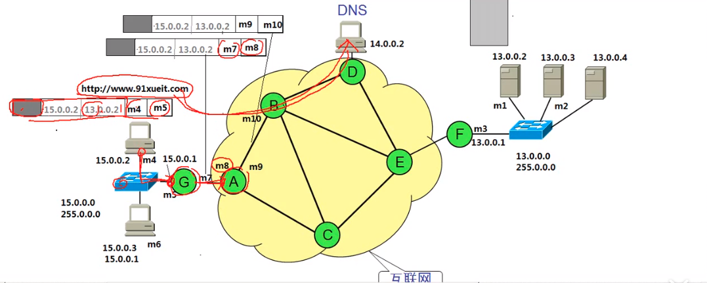
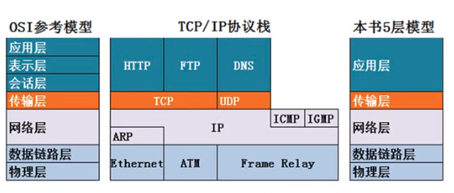
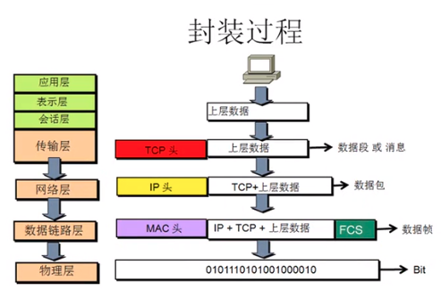

# 计算机网络笔记

## 基础

### 电脑访问服务器的过程中涉及的地址

在整个过程中,涉及两个地址,一个是物理地址map,另一个是IP地址,物理地址决定下一跳该往哪里走,而IP地址是发送的地址和目标地址,如下:

### 专业名词

- DNS:域名解析,这个的主要是对域名进行解析,当我们要访问一个网站的时候,首先给DNS发送一个请求,然后DNS就会返回一个IP地址,这样就可以通过这个IP地址找到相应的服务器.

### IPv6 与IPv4

两者的区别只是在网络层,而其他地方没什么大的改动.

### OSI参考模型对网络排错指导

从底层往高层查:

- 物理层故障:查看链接状态,发送和接收的数据包,查看网线断了,是物理层故障,看发送端和接断是否有包,如果只有一端能接收,可能是水晶头或者网线的问题;
- 数据链路层:有时候mac地址故障,比如管理员把某个mac地址为xx的禁止了,那就不能上网,欠费,网速协商不一致
- 网络层故障:配置错的IP地址,子网掩码错的网关,路由器没有配置到达目标网络的路由;
- 应用层故障:比如浏览器的问题

### OSI参考模型和网络安全

- 物理层安全
- 数据链路层安全:ADSL 账号密码 数据链路层安全 VLAN 交换机端口绑定Mac地址
- 网络层安全:在路由器上使用ACL控制数据包流量;
- 应用层安全:开发的应用程序没有漏洞

### 计算机网络的性能

- 速率:连接在计算机网络上的主机在数字信道上传输的数据位数的数量,也称为data rate或者bit rate,单位是:b/s,kb/s,Mb/s,Gb/s.
- 带宽:在数据通讯领域中,数字信道所能传送的最高速率;
- 吞吐量:即在单位时间内通过某个网络的数据量;
- 时延:发送时延,传播时延,处理时延,排队时延,发送时延等于数据块的长度除于信道宽度
- 时延宽积:等于传播时延乘于带宽
- 往返时间:从发送方发送数据开始到发送方接收方确认
- 利用率:包括信道利用率,网络利用率.

## 1 OSI模型

### 1.1 应用层

> 所有能产生网络流量的程序,能产生流量才是.

### 1.2 表示层

> 在传输之前是否进行加密或者压缩处理 二进制等
>
> 在访问网页时候,如果出现乱码情况,是编码问题的话,这个乱码就是在表示层发生的.

### 1.3 会话层

> 在这一层,可以通过工具查木马(netstat),通过查看哪些回话建立了,通过这个来查看木马.

### 1.4 传输层 

> 可靠传输,流量控制,不可靠传输,TCP协议和UDP协议,TCP协议是进行可靠传输,UDP 是进行不可靠传输;

### 1.5 网络层

> 负责最佳路径,规划IP地址

### 1.6 数据链路层

> 帧的开始和结束,透明传输,差错校验,mac地址

### 1.7 物理层

> 接口标准,电器标准,如何在物理链路上传输更快的速度.

包括机械特性,电器特性,功能特性,过程特性.传输的介质.包括通讯原理.如何对信号进行调制和解调.

**更多:** [计算机网络--物理层](https://blog.csdn.net/weixin_41863685/article/details/89042408)

## 物理层视频看完

